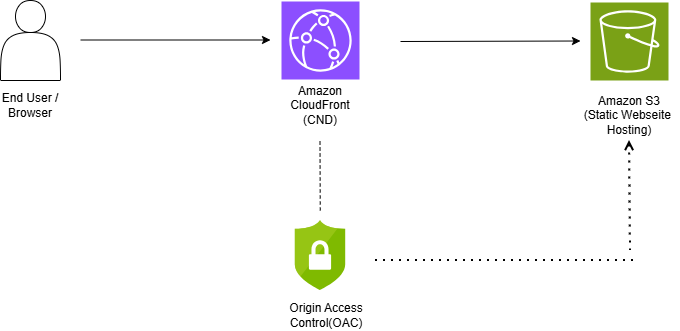
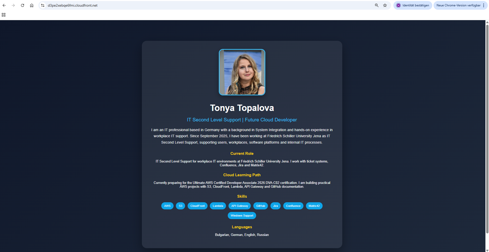
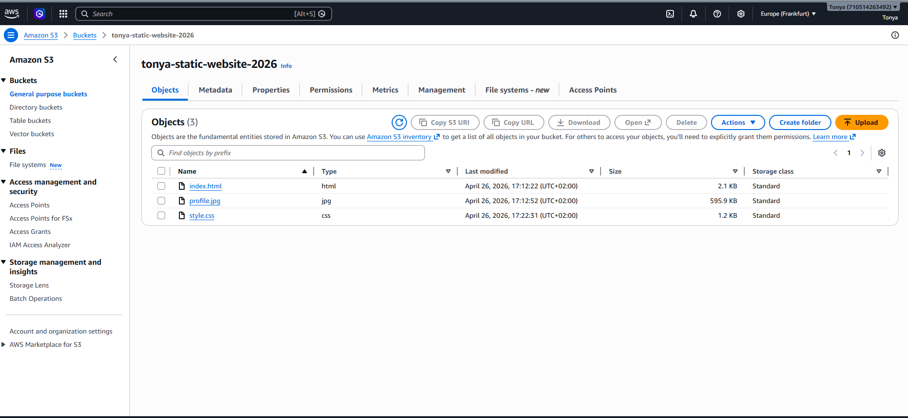
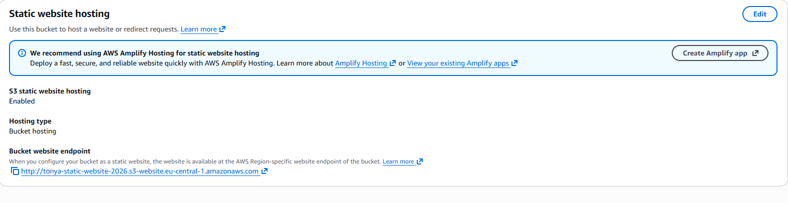
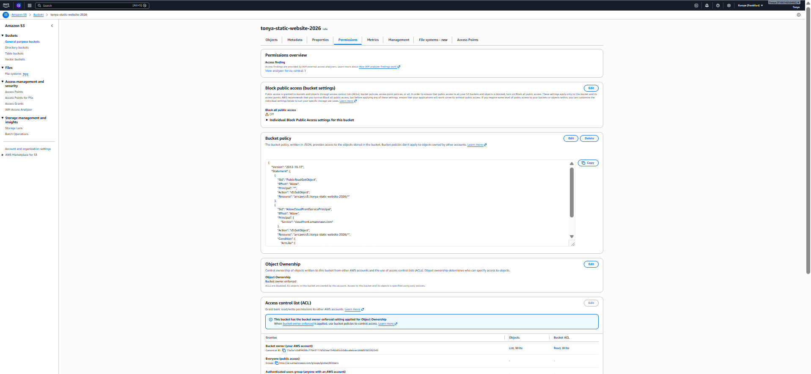
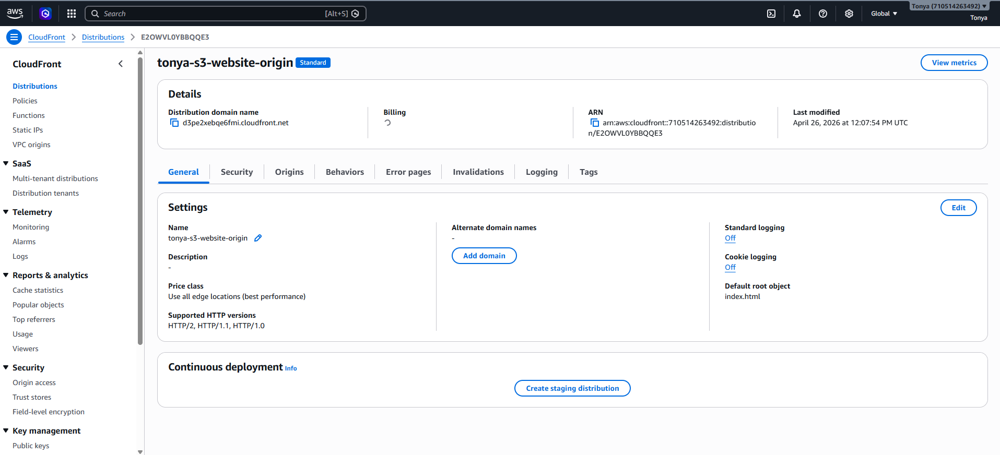

# AWS Static Website Hosting with S3 + CloudFront

## Project Overview
This project demonstrates how to host a static website on Amazon S3 and deliver it securely through Amazon CloudFront using Origin Access Control (OAC).

## Architecture Diagram

## Live Demo
Add your CloudFront URL here

## Technologies Used
- Amazon S3
- Amazon CloudFront
- Origin Access Control (OAC)
- HTML / CSS
- AWS IAM

## Features
- Static website hosting on S3
- Secure content delivery through CloudFront
- Restricted direct S3 access via OAC
- Personal portfolio landing page

## What I Learned
- How S3 static website hosting works
- How CloudFront caches and delivers content globally
- How to secure S3 with Origin Access Control
- How to deploy frontend files to AWS

## Future Improvements
- Add custom domain with Route 53
- Add HTTPS certificate via ACM
- Make website fully responsive for mobile devices

## Live Demo
- https://d3pe2xebqe6fmi.cloudfront.net

## Project Screenshots

### Live Website

### S3 Bucket Overview

### Static Website Hosting Configuration

### Bucket Policy / Permissions

### CloudFront Distribution

